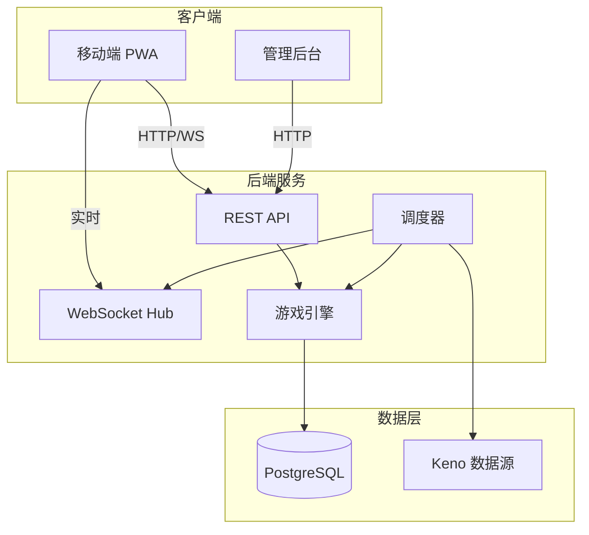

# 项目架构

## 系统概览



## 技术栈

| 层级 | 技术 | 说明 |
|------|------|------|
| **后端** | Go + Gin | 高性能 HTTP 框架 |
| **ORM** | GORM | 数据库访问 |
| **数据库** | PostgreSQL | 持久化存储 |
| **实时** | gorilla/websocket | WebSocket 推送 |
| **调度** | robfig/cron | 定时任务 |
| **管理后台** | Vite + React + Jotai | 现代化前端 |
| **移动端** | Vite + React + PWA | 可安装应用 |

## 目录结构

```
pcgame/
├── backend/                    # Go 后端
│   ├── cmd/server/main.go     # 入口点
│   ├── internal/
│   │   ├── api/               # HTTP 处理器
│   │   ├── config/            # 配置管理
│   │   ├── model/             # 数据模型
│   │   ├── service/           # 业务逻辑
│   │   ├── tasks/             # 定时任务
│   │   └── websocket/         # 实时推送
│   └── config.yaml            # 配置文件
│
├── admin-web/                  # 管理后台
│   ├── src/
│   │   ├── api/               # API 客户端
│   │   ├── components/        # 通用组件
│   │   ├── pages/             # 页面组件
│   │   └── store/             # Jotai 状态
│   └── vite.config.ts
│
├── mobile-client/              # 移动端 PWA
│   ├── src/
│   │   ├── api/               # API + WebSocket
│   │   ├── pages/             # 页面组件
│   │   └── store/             # Jotai 状态
│   └── vite.config.ts         # PWA 配置
│
└── docs/                       # 文档
    ├── architecture.md        # 架构文档
    └── business-flow.md       # 业务流程
```

## 核心模块

### 游戏引擎 (GameService)

- **算法**: 将 Keno 20 个数字转换为 PC28 结果 (0-27)
- **结算**: 根据投注类型和结果计算输赢

### 调度器 (Scheduler)

- 每分钟创建新轮次
- 自动关闭投注窗口
- 获取 Keno 结果并计算
- 结算所有注单

### WebSocket Hub

- 广播倒计时
- 推送开奖结果
- 通知轮次状态变更
