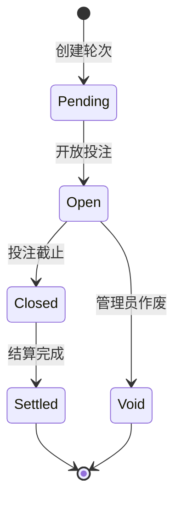
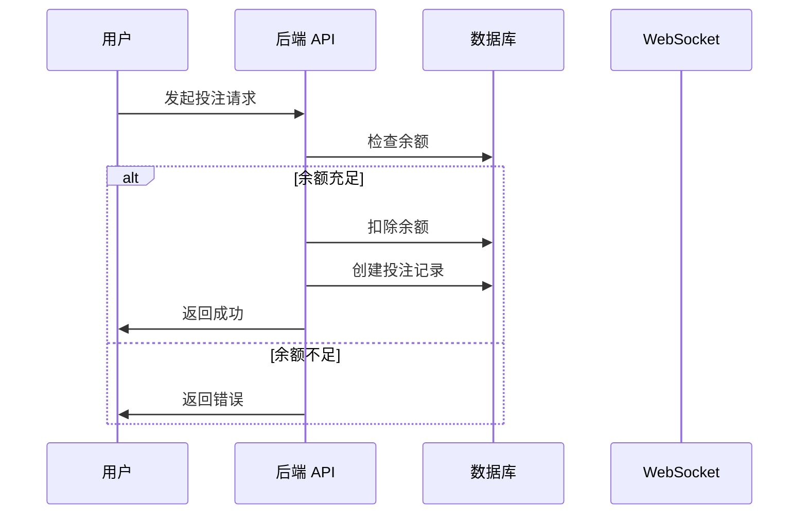
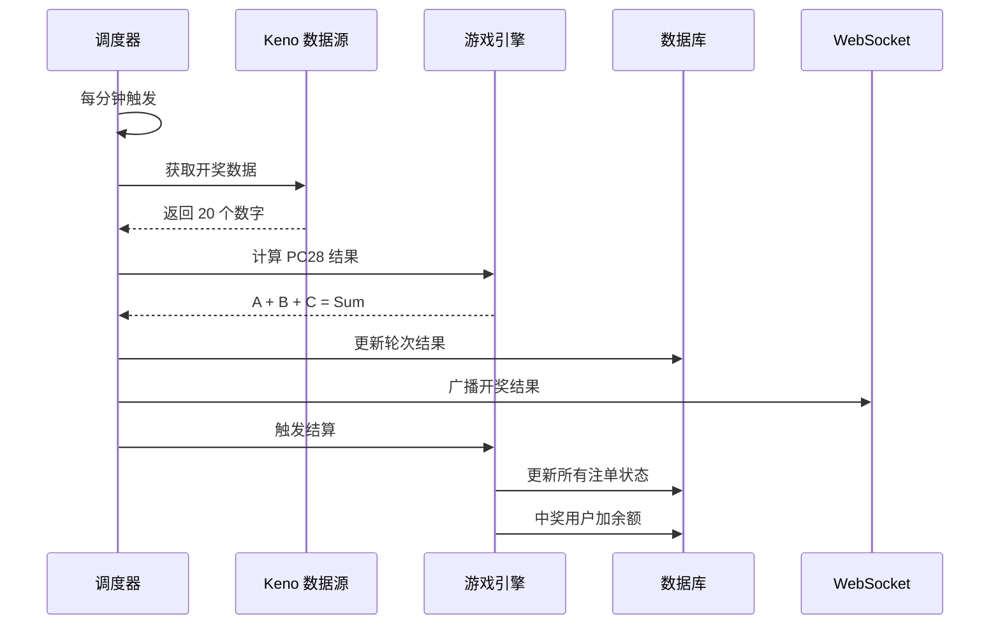

# 业务流程

## 游戏轮次生命周期

## 投注流程

## 开奖流程

## PC28 算法

1. **输入**: Keno 开奖的 20 个数字 (1-80)
2. **排序**: 升序排列
3. **计算**:
   - A = Sum(索引 0-5) % 10
   - B = Sum(索引 6-11) % 10
   - C = Sum(索引 12-17) % 10
4. **输出**: Sum = A + B + C (范围 0-27)

## 投注类型与赔率

| 类型 | 条件 | 赔率 |
|------|------|------|
| 大 | Sum ∈ [14, 27] | 1.95 |
| 小 | Sum ∈ [0, 13] | 1.95 |
| 单 | Sum 为奇数 | 1.95 |
| 双 | Sum 为偶数 | 1.95 |
| 数字 | 猜中具体和值 | 9.8 |

## 倒计时机制

- 轮次时长: 60 秒
- 投注窗口: 55 秒
- 最后 5 秒: 等待开奖
- WebSocket 每秒推送剩余时间
