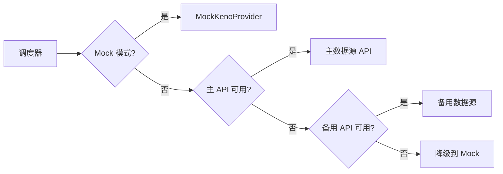

# 数据源配置

## 概述

PC28 游戏依赖 Keno 开奖数据源。由于第三方 Keno API 可能不稳定，系统设计了多层数据源策略。

## 数据源优先级



## Mock 数据源

开发和测试环境使用 Mock 数据源，自动生成符合规则的 Keno 数据。

```go
// 生成 20 个不重复的 1-80 随机数
func GenerateMockKenoData() []int {
    numbers := make([]int, 80)
    for i := 0; i < 80; i++ {
        numbers[i] = i + 1
    }
    rand.Shuffle(len(numbers), func(i, j int) {
        numbers[i], numbers[j] = numbers[j], numbers[i]
    })
    return numbers[:20]
}
```

**启用方式**: 在 `config.yaml` 中设置:
```yaml
game:
  use_mock_data: true
```

## 商业 API 选项

| 提供商 | 价格 | 延迟 | 可靠性 |
|--------|------|------|--------|
| OpenCai | 按量付费 | ~500ms | 高 |
| RapidAPI Keno | 订阅制 | ~800ms | 中 |
| 自建抓取 | 免费 | 不稳定 | 低 |

> ⚠️ **注意**: 生产环境必须使用商业 API，Mock 数据仅供测试。

## 接入商业 API

1. 获取 API Key
2. 配置环境变量:
   ```env
   KENO_API_URL=https://api.example.com/keno
   KENO_API_KEY=your-api-key
   ```
3. 修改 `config.yaml`:
   ```yaml
   game:
     use_mock_data: false
   keno:
     api_url: ${KENO_API_URL}
     api_key: ${KENO_API_KEY}
   ```

## 容错机制

- **超时**: 3 秒无响应切换备用
- **重试**: 最多 3 次
- **降级**: 所有源失败后使用 Mock + 延迟开奖
- **告警**: 连续失败 5 次触发告警
